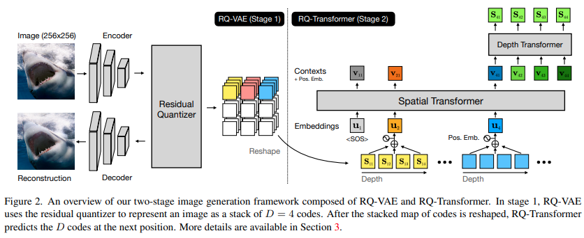

</img>

## RQ-Transformer

Implementation of <a href="https://arxiv.org/abs/2203.01941">RQ Transformer</a>, which proposes a more efficient way of training multi-dimensional sequences autoregressively. This repository will only contain the transformer for now, and attempt to extend it to greater than 2 dimensions. You can use <a href="https://github.com/lucidrains/vector-quantize-pytorch#residual-vq">this vector quantization library</a> for the residual VQ.

## Install

```bash
$ pip install RQ-transformer
```

## Usage

```python
import torch
from rq_transformer import RQTransformer

model = RQTransformer(
    num_tokens = 16000,             # number of tokens, in the paper they had a codebook size of 16k
    dim = 512,                      # transformer model dimension
    max_spatial_seq_len = 1024,     # maximum positions along space
    max_depth_seq_len = 4,          # maximum positions along depth (residual quantizations in paper)
    spatial_layers = 8,             # number of layers for space
    depth_layers = 4,               # number of layers for depth
    dim_head = 64,                  # dimension per head
    heads = 8,                      # number of attention heads
)

x = torch.randint(0, 16000, (1, 1024, 4))

loss = model(x, return_loss = True)
loss.backward()

# then after much training

logits = model(x)

# and sample from the logits accordingly
```

## Todo

- [ ] take care of sampling with generate method
- [ ] extend to 3 nested dimensions, use separate class, name it `AxialAutoregressiveTransformer`

## Citations

```bibtex
@unknown{unknown,
    author  = {Lee, Doyup and Kim, Chiheon and Kim, Saehoon and Cho, Minsu and Han, Wook-Shin},
    year    = {2022},
    month   = {03},
    title   = {Autoregressive Image Generation using Residual Quantization}
}
```
